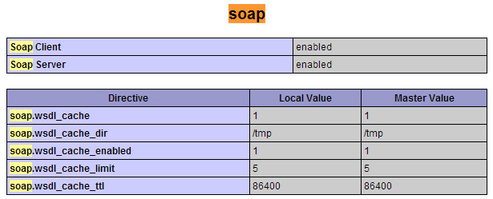

<div align="center">


# Código en PHP del Servicio Web  para Timbrar y Cancelar


</div>

Este es el ejemplo de uso para consumir el **Servicio Web en PHP  para generar Facturas, Notas, Recibos, Nómina, Carta Porte, Complemento de Pagos, etc)**.

Este servicio es ideal cuando ya generas el XML por medios propios y solo necesitas el timbrado. La integración es fácil y rápida en 10 minutos estarás emitiendo en nuestro ambiente de pruebas los CFDI la puesta en producción en menos de 1 hora.

Además el Servicio Web permitirá **cancelar uno o varios CFDI**

## Requerimientos

PHP 7 en adelante, se recomienda usar la última versión de PHP.

El ejemplo se realizó utilizando la herramienta nativa de **PHP SoapClient**, por lo que debe de estar habilitada antes de realizar la ejecución del servicio web.  Para validar que esté habilitada utilice el script **phpinfo(); **



En caso de que muestre la imagen anterior esto indica que está habilitado correctamente. En caso contrario realice lo siguiente: 

1. Abre el archivo** php.ini **en el carpeta de instalación de PHP

2. Elimine la cadena de comentario ; al inicio de la linea **extension=php_soap.dll o extension=soap**

3. **Reinicie el servidor **Apache, IIS o cualquier otro servidor web

4. Ejecute de nueva cuenta el script **phpinfo(); **

Al finalizar revisa que ya esté habilitada la extensión SOAP de la imagen anterior.

## Instalación

Obten la última versión de FacturoPorTi PHP en:

    git clone https://github.com/facturoporti/factura-electronica-Web-Service-PHP.git


## Timbrar

Descarga el repositorio que contiene lo necesarios para realizar el proceso de timbrado. Selecciona el archivo  el sistema realizará lo siguiente: 

```php
$fichero = file_get_contents('./xml/XEXX010101000_FAC_AC2_20190524.xml', true);

	$wsdl = "http://wcfpruebas.facturoporti.com.mx/Timbrado/Servicios.svc?wsdl";

	$soapClient = new SoapClient($wsdl); 
	
	$parametroSeguridad = array ('Usuario' => 'PruebasTimbrado','Contrasenia' => '@Notiene1');
	$parametro = array ('XMLEntrada' =>  $fichero);
	
	$retval = $soapClient->TimbradoMultiEmpresas(array ('parametroSeguridad' => $parametroSeguridad,'parametro' => $parametro));
	
	//print_r ($retval);
	echo ('UUID ' . $retval->TimbradoMultiEmpresasResult->Timbrado->UUID);
	echo ('Cadena Original ' . $retval->TimbradoMultiEmpresasResult->Timbrado->CadenaOriginal);
	echo ('Sello SAT ' . $retval->TimbradoMultiEmpresasResult->Timbrado->SelloSAT);
	echo ('Fecha Timbrado ' . $retval->TimbradoMultiEmpresasResult->Timbrado->Fecha);
	
	
	echo '<script language="javascript">';
	echo "alert('". $retval->TimbradoMultiEmpresasResult->Timbrado->TimbreXML . "')";
	echo '</script>';
	
```

## XML Timbrado

Al término el sistema te mostrará el UUID, cadena original, sello SAT, fecha de timbrado  además del timbre fiscal.


## Cancelar

Ingresa el folio fiscal (UUID) para realizar la cancelación: 

```php
 $fichero = file_get_contents('./Certificado/AAA010101AAA.pfx', true);
	$wsdl = "http://wcfpruebas.facturoporti.com.mx/Timbrado/Servicios.svc?wsdl";
    
	$soapClient = new SoapClient($wsdl); 
	//Envia las credenciales de acceso
	$parametroSeguridad = array ('Usuario' => 'PruebasTimbrado','Contrasenia' => '@Notiene1');
	// Agrega los parametros para cancelar uno o varios UUID
	$parametro = array ('RFC' =>  'AAA010101AAA', 'PFX' => $fichero, 'Password' => '12345678a', 'UUID' => array('a510d8e9-5f21-4e3c-8a04-6d65ac4ef174', 'd55e6169-f221-4bd7-8fe6-2bf0a12a1f69'));
	
	$retval = $soapClient->CancelarCFDICualquierPAC(array ('parametroSeguridad' => $parametroSeguridad,'parametro' => $parametro));
		
	print_r ($retval->CancelarCFDICualquierPACResult->FoliosRespuesta);
	
```

## Probar Cancelación de CFDI

Antes de ejecutar el método de cancelación del código deberás de actualizar los valores con tus datos fiscales; al término de la ejecución obtendrás la respuesta de la cancelación.

**Nota: El certificado digital que se debe de enviar es de tipo PFX si no se manda el correcto mandará error la cancelación**

## Documentación Adicional

Si deseas mas información del servicio web descarga la guía de integración,   contiene todos los atributos y su descripción además de los valores que son permitidos http://software.facturoporti.com.mx/WebService/Manual-Integracion-Web-Service.pdf


## Contribuir

1. Fork el repositorio 

2. Clona el repositorio

    git clone git@github.com:yourUserName/factura-electronica-Web-Service-PHP.git


3. Crea una rama 
```
    git checkout desarrollo
    git pull al original desarrollo
    # Podrás escoger el nombre de tu rama
    git checkout -b <feature/my_branch>
```
4. Haz los cambios necesarios y commit para carga los
```
    git add .
    git commit -m "mis cambios"
```
5. Envía los cambios a GitHub
```
    git push origin <feature/my_branch>
```

***-

## License

Desarrollado en México por [FacturoPorTi](https://www.FacturoPorTi.com.mx). Licencia de uso [Ver mas](https://github.com/facturoporti/factura-electronica-Web-Service-PHP/blob/master/Licencia).
****

